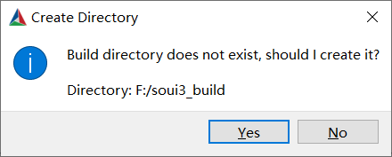
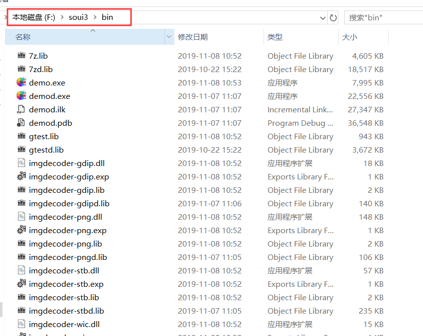

# 编译

SOUI提供编译方式有qmake（推荐）,cmake.

## `qmake`(推荐)
    使用 git 拉取代码后,进入代码根目录,双击运行"Build.bat"
    * `1.选择编译版本[1=x86;2=x64;3=x86+x64]:`选择需要编译的cpu架构(eg:1则表示生成win32的可执行文件)
    * `2.选择开发环境[1=2005;2=2008;3=2010;4=2012;5=2013;6=2015;7=2017;8=2019]:`选择对应的 Visual Studio 版本(eg:1表示选择使用 Visual Studio 2008)注意SOUI至少需要Visual Studio 2008 SP1及以上的 Visual Studio 版本
    * `3.选择SOUI编译模式[1=全模块DLL;2=全模块LIB;3=内核LIB,组件DLL(不能使用LUA脚本模块)]:`选择生成内核的文件方式(eg:1表示所生成的内核文件及组件均为dll)
    * `4.选择字符集[1=UNICODE;2=MBCS]:`(推荐选1)
    * `5.将WCHAR作为内建类型[1=是;2=否]:`(推荐选1)
    * `6.选择CRT链接模式[1=静态链接(MT);2=动态链接(MD)]:`(根据自大项目需求选择)
    * `7.是否为release版本生成调试信息[1=生成;2=不生成]:`(根据自大项目需求选择)
    * `open[o], compile[c] "soui.sln" or quit(q) [o,c or q]?`输入英文字母o表示打开工程项目,c表示直接编译debug与release,q表示直接退出当前窗口

## `cmake`

从cmake官网下载cmake的最新Release版本,这里以cmake-3.15.4-win64-x64.zip举例。

1.将cmake-3.15.4-win64-x64.zip解压后运行bin目录下的cmake-gui.exe。

2。选择soui源码目录和cmake临时文件生成目录，点击Configure。

3。弹出临时文件目录不存在，是否创建？选择Yes。   

4.选择需要生成的VS版本(如果未安装会生成失败,根据实际情况选择)和需要生成的编译版本(Win32\x64)，点击Finish。   

5。根据需要选择生成方式：内核和组件模块的(静态链接或动态链接)；是否使用CRT；Unicode或多字节；点击Generate开始生成。   

6。生成完毕,显示"Generating done"，此时点击Open Project打开项目(也可以双击cmake临时文件生成目录中找到sln文件打开)

7。在VS中编译，编译完成后,在soui源码的bin目录下可以找到生成出来的dll(或lib)和exe。

## 老版本中64位的问题的说明

新版本32 64分离，方便同时编译32+64方式，向导已更新支持

要同时支持32+64目前使用相对麻烦一点,方法如下：

1 分别运行bat生成，32位和64位，如果要向导正常工作请保持两项配置保持一致。

2 分别编译soui.sln和soui64.sln。

3 使用向导生成项目。

其它说明：如果生成的是DLL版本。请注意64位可以会提示找不到DLL。因为64位版本输出目录bin64并没有加入PATH。